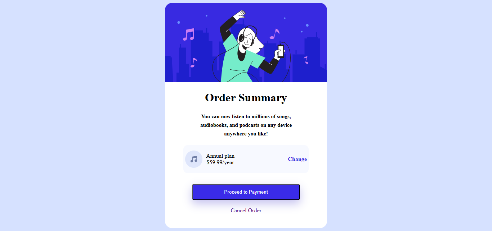

# Frontend Mentor - Order summary card solution

This is a solution to the [Order summary card challenge on Frontend Mentor](https://www.frontendmentor.io/challenges/order-summary-component-QlPmajDUj). Frontend Mentor challenges help you improve your coding skills by building realistic projects. 

## Table of contents

- [Overview](#overview)
  - [The challenge](#the-challenge)
  - [Screenshot](#screenshot)
- [My process](#my-process)
  - [Built with](#built-with)
  - [What I learned](#what-i-learned)
  - [Continued development](#continued-development)
- [Author](#author)

## Overview

### The challenge

Users should be able to:

- See hover states for interactive elements
- View the optimal layout depending on their device's screen size

### Screenshot



## My process

### Built with

- Semantic HTML5 markup
- CSS custom properties
- Flexbox for layout
- CSS transitions for hover effects
- Google Fonts (Red Hat Display)
- Mobile-first workflow

### What I learned

Throughout this project, I reinforced my understanding of CSS Flexbox and learned how to properly align items within a container. One of the key challenges was getting the plan section to display correctly with the icon and text on the left while keeping the "Change" link aligned to the right.

Here's the CSS solution I implemented for the plan section:

```css
.plan {
   background-color: #f7f9ff;
    padding: 5px;
    border-radius: 12px;
    display: flex;
    align-items: center;
    justify-content: space-between;
    width: 75%;
    margin: 0 auto;
    margin-bottom: 30px;
}

.plan1 {
    display: flex;
    align-items: center;
    gap: 10px;
    justify-content: center;
}
```

The key was using `justify-content: space-between` on the parent container to push the "Change" link to the right, while grouping the icon and text together in a nested div with its own flexbox layout.

I also learned about using CSS transitions to create smooth hover effects:

```css
.change {
    text-decoration: none;
    font-weight: 600;
    color: #3829E0;
    transition: 0.3s;
}

.change:hover {
    color: purple;
}

.but {
    background-color: #3A2BE8;
    width: 300px;
    color: white;
    padding: 13px;
    border-radius: 6px;
    margin-bottom: 20px;
    cursor: pointer;
    transition: 0.3s; 
    box-shadow: 0 10px 25px rgba(67, 56, 202, 0.3);  
}

.but:hover {
    background-color: purple;
}
```

Another important lesson was understanding how to use `display: inline-block` for links that need vertical spacing:

```css
.cancel {
    text-decoration: none;
    margin-bottom: 40px;
    display: inline-block;
    transition: all 0.3s;
}
```

I also learned how to center content using Flexbox on the body element:

```css
body {
    background-color: #D6E1FF;
    font-family: "Red Hat Display";
    text-align: center;
    justify-content: center;
    align-items: center;
    display: flex;
}
```

### Continued development

In future projects, I want to continue focusing on:

- Improving responsive design for smaller mobile devices
- Learning CSS Grid for more complex layouts
- Adding more advanced animations and transitions
- Better understanding of accessibility features (ARIA labels, semantic HTML)
- Working with CSS variables for theme management
- Implementing proper form validation
- Adding box-shadow effects more strategically

I noticed a small typo in my CSS where I wrote `.cancle:hover` instead of `.cancel:hover`, which is something I need to be more careful about in the future.

## Author

- Frontend Mentor - [@greythedev](https://www.frontendmentor.io/profile/greythedev)
- Twitter - [@greythedev](https://x.com/greythedev)